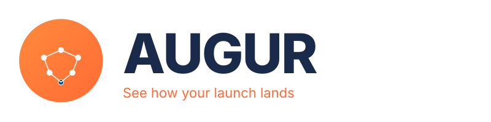
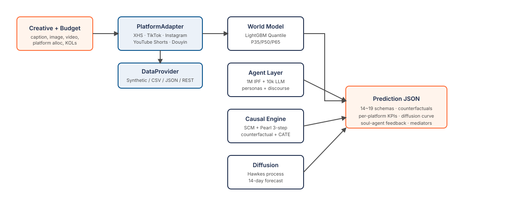

<div align="center">


### See how your launch lands — before you ship it.

<p>
  <a href="https://github.com/horton2048/augur/blob/main/LICENSE"></a>
  <a href="https://github.com/horton2048/augur/releases"></a>
  <a href="#"></a>
  <a href="https://github.com/horton2048/augur/actions/workflows/ci.yml"></a>
  <a href="https://github.com/horton2048/augur/stargazers"></a>
</p>

<p>
  <strong>🇬🇧 English</strong> · <a href="README.zh-CN.md">🇨🇳 中文</a>
</p>

<p><em>Launch foresight for makers.<br/>Rehearse a product or content launch over a virtual-consumer society — get the ROI, the 14-day curve, and a clear go / tune / hold call before you spend a dollar.</em></p>
</div>

---

<p align="center">

</p>

**For indie makers, solo brand owners, and small creator teams.** Before you sink money and weeks into a launch, **Augur runs it first**. Drop in your creative + budget + platform + KOL shortlist, and it rehearses the rollout across a **1M+ virtual-consumer society** with LLM-backed personas that actually *read* your creative. You get back a pre-launch **ROI forecast with confidence bands**, a **14-day diffusion curve**, and a plain-language **go / tune / hold** verdict — plus a cinematic **replay** of how the launch ripples out. It's a transparent causal engine, fully open-source, so you can trace every number back to the decision that produced it instead of trusting a black box.

*This repo is the real engine — the same causal stack, running on a built-in demo corpus. Clone it, run a launch, audit the mechanism end-to-end. No sign-up, no key required to get a first prediction.*

---

## What it's for

Augur answers the three questions every launch comes down to — the ones you normally only get to answer *after* you've already spent the money:

### 1. Before you launch
> *"I have 4 creative cuts × 3 KOL shortlists × 2 budget tiers — which combination actually lands?"*

The usual way: pick on gut, spend, find out in two weeks. **Augur**: a 60-second simulation on $0 ranks all 24 combinations with P35/P65 confidence bands, so you launch the top 3 instead of guessing.

### 2. During the launch
> *"Day 3 is below target. If I swap two KOLs and shift budget to three others — does it actually move?"*

The usual way: stare at a dashboard and hope. **Augur**: `do(kol=swap_A_for_B, day=3)` rolls the next 14 days forward *with the change applied* and shows you the path difference in 30 seconds.

### 3. After it's over
> *"This one underperformed. If I'd put the budget on a different platform, would it have done better?"*

The usual way: a vague post-mortem with no real answer. **Augur**: load the actuals + `do(platform=...)` and get the counterfactual curve over the same audience — a confident read on what *would* have happened.

Same engine, three decisions. Below is how it's built and why you can trust the numbers.

---

## Why you can trust the numbers

Most "predict your launch" tools hand you a single number with no derivation — a black box you're asked to take on faith. Augur is built the opposite way: every prediction is decomposable, and the whole engine is in this repo.

### 🔬 Audit the engine yourself

This is the **full causal engine**, not a marketing demo. Clone it, run your own scenarios, and trace any prediction back through the 64-node causal graph to *which* agent decision and *which* budget-curve calculation produced it. No "trust us, it's ML" — you can follow the reasoning.

```bash
git clone https://github.com/horton2048/augur.git && cd augur
pip install -e '.[dev]' && python -m uvicorn oransim.api:app --port 8001 &
curl http://localhost:8001/api/graph/inspect   # the causal graph, in JSON
```

### 📊 It ships with everything it needs to run

The repo includes a small reference corpus (21k notes / 2k scenarios / 100 event streams) and a pretrained baseline model — enough to exercise every code path and get real predictions out of the box. When you're ready, point it at your *own* data (CSV / JSONL / a REST endpoint / your DB) through the `DataProvider` interface — see [📦 Data](#-data--bring-your-own).

### 📚 Grounded in 12 years of research, not vibes

Every layer traces to peer-reviewed work, not a prompt:

<details>
<summary>Architecture + research lineage (click to expand)</summary>

- **Per-arm counterfactual heads** — TARNet (Shalit ICML 2017) · Dragonnet (Shi NeurIPS 2019)
- **Representation balancing** — HSIC (Gretton 2005) · adversarial-IPTW · BCAUSS · CaT (Melnychuk ICML 2022)
- **In-context amortization** — CInA (Arik & Pfister NeurIPS 2023)
- **Causal Neural Hawkes Process** — Mei & Eisner NeurIPS 2017 + Zuo ICML 2020 + Geng NeurIPS 2022 counterfactual TPP
- **Budget curves** — Hill saturation (Dubé & Manchanda 2005) + frequency fatigue (Naik & Raman 2003)
- **SCM** — Pearl 3-step (abduction → action → prediction), 64 nodes / 117 edges, discourse + cascade mediators (Sunstein 2017 · Bikhchandani 1992)
- **Agent population** — IPF / Deming-Stephan 1940 baseline

See `backend/oransim/{world_model,diffusion,causal}/` — every file has inline citations.
</details>

---

## 🚀 Quickstart (60 seconds)

```bash
# 1. Clone and install
git clone https://github.com/horton2048/augur.git
cd augur
pip install -e '.[dev]'

# 2. Run backend (mock mode — no API key required)
LLM_MODE=mock python -m uvicorn oransim.api:app --port 8001 &

# 3. Run frontend
python -m http.server 8090 --directory frontend

# 4. Open http://localhost:8090 → click "⚡ 极速" → "🚀 Predict"
```

> 📦 **The Python package is still imported as `oransim`** — only the product is named Augur. Clone URLs, `import oransim`, and `oransim.api:app` are unchanged so existing code and tooling keep working.

> 📌 **What you're running on** — the Quickstart consumes `data/synthetic/` (2k scenarios / 500 notes / 100 event streams) and `data/models/world_model_demo.pkl` (a LightGBM model trained on the synthetic corpus). It's a **demo dataset calibrated to public-report means** — deterministic, reproducible, good enough to exercise every code path, but **not real traffic**. To plug in your own data, jump to [📦 Data](#-data--bring-your-own).

Mock mode returns deterministic stubs — good for a first look — but every LLM-driven feature (soul personas, group-chat, comment-section discourse, LLM calibration) falls back to templates. **To unlock the real pipeline, switch to api mode:**

```bash
LLM_MODE=api \
LLM_API_KEY=sk-xxxxx \
LLM_MODEL=gpt-5.4 \
python -m uvicorn oransim.api:app --port 8001 &
```

Pick the native request format with `LLM_PROVIDER` — defaults to `openai` (also covers DeepSeek / vLLM / any OpenAI-compat gateway):

<details>
<summary>Per-provider recommended config (click)</summary>

| `LLM_PROVIDER` | `LLM_BASE_URL` | `LLM_MODEL` example | Key env |
|---|---|---|---|
| `openai` *(default)* | `https://api.openai.com/v1` | `gpt-5.4` · `gpt-4o-mini` | `OPENAI_API_KEY` or `LLM_API_KEY` |
| `openai` (DeepSeek) | `https://api.deepseek.com/v1` | `deepseek-chat` | `LLM_API_KEY` |
| `openai` (vLLM local) | `http://localhost:8000/v1` | any served model | `LLM_API_KEY=local` |
| `anthropic` | `https://api.anthropic.com` (default) | `claude-sonnet-4-6` | `ANTHROPIC_API_KEY` or `LLM_API_KEY` |
| `gemini` | Google default | `gemini-2.5-pro` · `gemini-2.5-flash` | `GEMINI_API_KEY` / `GOOGLE_API_KEY` / `LLM_API_KEY` |
| `qwen` | `https://dashscope.aliyuncs.com/api/v1` (default) | `qwen-plus` · `qwen-turbo` | `DASHSCOPE_API_KEY` / `QWEN_API_KEY` / `LLM_API_KEY` |

Full reference in [`.env.example`](.env.example); extended retry / fallback-chain options in [`docs/en/quickstart.md`](docs/en/quickstart.md).

</details>

The frontend shows a yellow banner whenever the backend is still in mock (or has no key set) — click ✕ to dismiss for the session.

> **Running right now · what's real vs aspirational**
> - ✅ **Working today** — full backend (`POST /api/predict` · `/api/adapters` · `/api/sandbox/*`, split across `api_routers/`) · full frontend (hero · 9 tabs · cascade animation · cinematic replay) · LightGBM quantile baseline pkl shipped · 5 platform adapters (XHS v1 + TikTok agent-level w/ FYP RL + IG / YouTube Shorts / Douyin MVP) · learned amortized abduction (pure-numpy MLP) · multi-LLM providers (OpenAI-compat · Anthropic · Gemini · Qwen).
> - 🟡 **Code-complete, weights pending** — Causal Transformer world model + Causal Neural Hawkes diffusion — architecture + training loop + inference + thinning sampler all shipped; pretrained weights land with OrancBench v0.5.
> - 📋 **Roadmap-only** — Twitter / Bilibili / LinkedIn adapters · multi-modal embedders (image/video/audio stubs only today) · hosted demo.

---

## 🎬 See It In Action

<table>
<tr>
<td width="50%" valign="top">

**Three-panel working UI** — left: creative + budget + sliders · center: KPI / Agent pool / AI group-chat tabs (+「更多 ›」dropdown for deep analysis) · right: per-persona LLM reactions.


</td>
<td width="50%" valign="top">

**Opinion-propagation through an agent-based society** — drop in your creative, watch color-coded opinion waves (green=click / purple=high intent / red=skip / blue=curious) ripple outward from KOL seeds, cascading to their followers in real time.


</td>
</tr>
</table>

---

## 📦 Data · bring your own

Augur separates the **engine** (world model, SCM, Hawkes, souls, platforms) from the **data** that flows through it. The repo ships a small synthetic dataset so every code path works out of the box; every path is replaceable with your own source.

### What ships in the box

| File | What it is | How it's used |
|---|---|---|
| `data/synthetic/notes_v3.json` | 500 synthetic notes · 10 niches | caption / tag / fans / engagement priors |
| `data/synthetic/scenarios_v0_1.jsonl` | 2k scenarios · synthetic campaigns | world-model training + held-out eval |
| `data/synthetic/event_streams_v0_1.jsonl` | 100 synthetic Hawkes event streams | diffusion forecaster fit |
| `data/synthetic/niche_priors_calibrated.json` | Per-niche CTR / CVR prior means | fallback when world model has no signal |
| `data/models/world_model_demo.pkl` | LightGBM quantile baseline (~3 MB) | shipped weights — retrain with `backend/scripts/gen_synthetic_data.py` |
| `data/niches.json` | **Niche registry** (10 entries) | single source of truth for niche keys, labels, CTR priors, synonyms |

> ⚠️ **This is a demo dataset, not truth.** The synthetic generator calibrates to public-report means (CTR / engagement ranges from widely cited industry reports) but doesn't reflect any specific platform's real traffic or your particular audience. For real launch decisions, plug in your own data via a `DataProvider` (below).

### Plugging in your data — three paths

Augur's `DataProvider` interface lives in `oransim/platforms/providers/`. Pick the path that matches where your data lives:

| Provider | When to use | Contract | Reference |
|---|---|---|---|
| `CSVProvider` | batch export from BI / a spreadsheet | one CSV per table (`notes.csv`, `kols.csv`) | [`docs/en/platforms/writing-a-provider.md`](docs/en/platforms/writing-a-provider.md) |
| `JSONLProvider` | streamed events (Kafka tailed to file) | one JSON object per line | same doc |
| `OpenAPIProvider` | live REST / GraphQL | implement 4 read endpoints | same doc |
| *Write-your-own* | PostgreSQL / ClickHouse / Snowflake / BigQuery | subclass `DataProvider` | same doc |

**Minimum schema** your source needs to expose:

```yaml
notes:
  - note_id, caption, niche, platform, publish_time,
    author_fans_count, read_count, like_count, collection_count, comment_count
kols:
  - anchor_id, nick, niche, platform, fan_count,
    interaction_rate, ad_price_cny
```

Field names can be remapped via `provider.field_map`; the exact shape is documented in [`writing-a-provider.md`](docs/en/platforms/writing-a-provider.md).

### Adding a new niche

If your data covers niches beyond the 10 shipping demo niches (e.g. automotive, healthcare, toys-and-collectibles), **edit `data/niches.json`** — add one entry per niche:

```json
{
  "key": "auto",
  "zh": "汽车",
  "en": "Automotive",
  "synonyms": ["新能源车", "试驾", "特斯拉", "SUV"],
  "ctr_prior": {"mu": 0.024, "sigma": 0.010, "n": 860},
  "bias_caption": "汽车 试驾 新能源车 改装",
  "female_ratio": 30
}
```

That's the only edit. The registry is loaded at import time by `oransim.config.niches` and every niche-aware component (KOL library, caption→category detection, CTR priors, structured schema outputs, soul prompt rendering) reads from there — no scattered hardcoded tables to hunt down. Point at a custom path with `ORAN_NICHES_PATH=/srv/my_niches.json` if you'd rather not edit the in-repo file.

### Telling when you're on demo data vs real data

The frontend shows a persistent banner whenever:
- `LLM_MODE=mock` (no LLM key) — templates instead of real LLM
- No custom `DataProvider` registered — reading `data/synthetic/`

Both clear once you ship a real key + a real provider. The system-status panel also exposes `GET /api/health`'s `data_source` field for observability.

---

## 🏗️ Architecture

<div align="center">

</div>

A typical prediction request flows: **Creative + Budget** → **PlatformAdapter** (pulls data via pluggable **DataProvider**) → **World Model** (factual + counterfactual predictions) + **Agent Layer** (POP_SIZE-scalable IPF + LLM personas) → **Causal Engine** (64-node causal graph + `do()` counterfactuals) → **Diffusion** (14-day intervention-aware rollout) → **Prediction JSON** (14–19 schemas).

**What runs where:**

| Surface | Default (ships today) | Research-grade (opt-in) |
|---|---|---|
| World model | LightGBM quantile baseline (`data/models/world_model_demo.pkl`) + hand-coded structural formula | `CausalTransformerWorldModel` (CaT / TARNet / Dragonnet / CInA) — train locally, or swap in via `POST /api/v2/world_model/predict?model=causal_transformer` |
| Diffusion | Parametric exponential-kernel Hawkes (Hawkes 1971) | `CausalNeuralHawkesProcess` (Mei & Eisner + Zuo et al. + Geng et al.) — same opt-in pattern: `POST /api/v2/diffusion/forecast?model=causal_neural_hawkes` |
| Agents | `StatisticalAgents` (vectorised, CPU) | `SoulAgentPool` LLM personas (enable via `use_llm=true` on `/api/predict`) |
| Sandbox | Budget-only slider uses a Hill-saturation + frequency-fatigue closed form (`mode: "fast_approx"`) so the slider is responsive. Non-budget edits (creative / alloc / KOL) trigger a real model re-run (`mode: "counterfactual"` or `"full_rerun"`). | — |

*The registry is the extension point. Default `/api/predict` uses the baseline stack because it's what ships with weights today; `/api/v2/*` is how you A/B swap in the research stack once you've trained it. Both routes share the same SCM / agent / Hawkes plumbing.*

Two-axis extensibility:
- **Platform** axis — XHS (legacy, v1 live) + TikTok / Instagram / YouTube Shorts / Douyin (MVP on synthetic); Twitter / Bilibili / LinkedIn on roadmap
- **Data Provider** axis — pluggable per platform (Synthetic / CSV / JSON / OpenAPI / your own)

See [`docs/en/architecture.md`](docs/en/architecture.md) for the full design.

---

## 🌐 Platform Adapter Matrix

| Platform             | Region   | Status  | Data Provider                       | World Model          | Milestone |
|----------------------|----------|---------|-------------------------------------|----------------------|-----------|
| 🔴 XHS / RedNote     | Greater China | ✅ v1   | Synthetic / CSV / JSON / OpenAPI | Causal Transformer + LightGBM baseline | — |
| ⚫ TikTok            | Global   | 🟢 MVP  | Synthetic                        | LightGBM baseline    | v0.5 (real panels) |
| 🟣 Instagram Reels   | Global   | 🟢 MVP  | Synthetic                        | LightGBM baseline    | v0.5 (real panels) |
| 🔴 YouTube Shorts    | Global   | 🟢 MVP  | Synthetic                        | LightGBM baseline    | v0.5 (real panels) |
| 🔵 Douyin            | Greater China | 🟢 MVP | Synthetic                        | LightGBM baseline    | v0.5 (real panels) |
| ⚪ Twitter / X       | Global   | 📋 planned | —                             | —                    | v0.5 |
| 📺 Bilibili          | Greater China | 📋 planned | —                        | —                    | v1.0 |
| ✒️ LinkedIn          | Global   | 📋 planned | —                             | —                    | v1.0 |

> *What "MVP" actually means here*: XHS is the canonical v1 adapter with real data-provider paths (CSV / JSON / OpenAPI). TikTok / IG / YouTube Shorts / Douyin ship as **config-differentiated wrappers** over the same `PlatformAdapter` interface (each has distinct CPM / CTR / CVR / duration priors — see `backend/oransim/platforms/{platform}/adapter.py`), all driven by the synthetic LightGBM baseline. They pass shape tests end-to-end but don't yet have platform-specific DataProviders hooked up; that's what "v0.5 (real panels)" means.

**Want another platform?** Open an [Adapter Request](https://github.com/horton2048/augur/issues/new?template=adapter_request.yml) — we prioritize based on community demand.

---

## 📊 What You Get — 14 to 19 Schemas

A single `/api/predict` call returns structured outputs across these schemas:

1. **total_kpis** — aggregate impressions / clicks / conversions / cost / revenue / CTR / CVR / ROI with P35/P50/P65 bands
2. **per_platform** — KPIs broken down per platform adapter
3. **per_kol** — KOL-level attribution
4. **diffusion_curve** — 14-day daily impression/engagement forecast (Causal Neural Hawkes; parametric Hawkes as baseline)
5. **cate** — Conditional Average Treatment Effect across agent demographics
6. **counterfactual** — "What if" branching: alternative creative / budget / KOL
7. **soul_feedback** — 10 LLM persona reactions in natural language
8. **group_chat** — simulated group conversation dynamics (Sunstein 2017 polarization)
9. **discourse** — second-wave mediator impact estimation
10. **final_report** — LLM-generated executive summary
11. **verdict** — top-line recommendation (go / tune / hold)
12. **kol_optimizer** — optimal KOL mix given objective
13. **kol_content_match** — creative × KOL compatibility scoring
14. **tag_lift** — incremental performance from tag/targeting choices
15. **mediator_impact** — path analysis from discourse/group_chat to funnel
16. **brand_memory** — longitudinal brand preference updates
17. **sandbox_snapshot** — serialized session state for "undo / redo"
18. **audit_trace** — explainability — which agents, which paths, which weights
19. **benchmark** — performance against OrancBench

See [`docs/en/schemas/`](docs/en/schemas/) for JSON schema definitions.

---

## 🧠 Under the Hood

<details id="causal-graph">
<summary><b>Causal Graph</b> — 64 nodes, 117 edges</summary>

Hand-designed to cover the launch funnel: impression → awareness → consideration → conversion → repeat purchase → brand memory, with mediators for group discourse (Sunstein 2017) and information cascades (Bikhchandani et al. 1992).

The graph includes long-term feedback loops (e.g. `repeat_purchase → brand_equity → ecpm_bid → next-cycle impression_dist`). This is intentional — it reflects real launch physics, not a modeling artifact. Strict Pearl-style abduction on cycles is undefined; our `do()` evaluation uses the cyclic-SCM generalization of Bongers et al. 2021 ([Foundations of Structural Causal Models with Cycles and Latent Variables](https://arxiv.org/abs/1611.06221)), treating the 25-node feedback SCC as a fixed-point solve rather than a topological forward pass.

The 3-step evaluation in code:
1. **Abduction** — at the agent layer, re-use the sampled noise from baseline; at the graph layer, per-node residuals are frozen
2. **Action** — apply `do()` intervention (supported nodes listed in `/api/dag`'s `intervenable: true` set)
3. **Prediction** — topologically sort the acyclic condensation, solve each SCC by numerical iteration (2–3 passes empirically converge on the shipped graph)

A time-unrolled DAG projection is available via `oransim.causal.scm.dag_dict_unrolled(n_steps=K)` — each original node becomes `N_t0, N_t1, ..., N_t{K-1}`; feedback edges cross time (`src_ti → dst_t{i+1}`), non-feedback edges replicate within each slice. At `n_steps=2` the shipped graph's 64 nodes + 117 edges (cyclic) unroll to 128 nodes + 220 edges (strict DAG, 14 feedback edges detected automatically via DFS back-edge analysis). Downstream modules that need strict acyclicity (CausalDAG-Transformer attention on a true DAG, textbook Pearl three-step abduction) can consume the unrolled view. The cyclic native graph + SCC condensation remains the default because it keeps the node count small and matches the shipped Transformer's 7-token input layout.
</details>

<details>
<summary><b>Agent Population</b> — POP_SIZE-scalable IPF-calibrated virtual consumers</summary>

Generated via Iterative Proportional Fitting (IPF / Deming-Stephan 1940) against real Chinese demographic distributions (age × gender × region × income × platform). Each agent carries:
- Demographics + psychographics
- Platform-specific engagement priors
- Niche/category affinity vectors
- Time-of-day activity curves
- Social graph embeddings
</details>

<details>
<summary><b>Soul Agents</b> — LLM personas for qualitative feedback</summary>

The top-K most salient agents for a scenario are upgraded to LLM-backed personas (`SOUL_POOL_N` configurable; default 100 for demo). Default model: `gpt-5.4`. Each persona:
- Generates a persona card from its demographic vector
- Evaluates the creative (reaction / emotional response / intent)
- Optionally participates in simulated group chats (Sunstein 2017 group polarization)
- Feeds second-wave mediators back into the causal graph

**Two modes, explicit trade-off**:

- **Template mode** (`use_llm=False`, default) — click decision is a Bernoulli draw against the statistical `click_prob` (+40% niche-match lift); the persona picks a consistent template `reason` / `comment` / `feel`. Zero LLM cost, deterministic given seed, used for CATE / ROI numerical reproducibility.
- **LLM-decider mode** (`use_llm=True`, Park et al. 2023 Generative Agents style) — a real LLM gets the full persona card + creative + KOL context and returns structured JSON (`will_click`, `reason`, `comment`, `feel`, `purchase_intent_7d`). **The LLM's `will_click` is the agent's decision** (not overridden by Bernoulli); the statistical `click_prob` is available as a prior in the prompt. Response tagged `source: "llm"`. Trade-off: adds non-determinism per persona; for strict reproducibility stay in template mode or pin `LLM_TEMPERATURE=0`.

Cost controlled via in-flight request coalescing (leader/follower dedup), persona card caching, and a configurable `SOUL_POOL_N`.
</details>

<details id="causal-transformer-world-model">
<summary><b>Causal Transformer World Model</b> — primary (research-grade)</summary>

A 6-layer × 256-dim causal Transformer that ingests heterogeneous campaign features and predicts three quantile levels (P35/P50/P65) for each funnel KPI. Architecture lifts ideas from recent causal-Transformer literature:

- **Token-type factorization** (CaT, Melnychuk et al. ICML 2022) — inputs split into *Covariate* (platform, demographic, time), *Treatment* (creative embedding, budget, KOL), and *Outcome* (KPIs) tokens with distinct type embeddings
- **DAG-aware attention** (CausalDAG-Transformer) — attention mask derived from the 64-node causal graph restricts each token to attend to topological ancestors; per-head learnable gate on the bias. Because the shipped graph is cyclic, ancestry is defined on the graph's **SCC condensation** (Bongers 2021 §3.2). Reference implementation in `CausalTransformerWorldModel.set_dag_from_edges()`, toggleable via `dag_attention_bias=True`.
- **Per-arm counterfactual heads** (TARNet, Shalit et al. ICML 2017 / Dragonnet, Shi et al. NeurIPS 2019) — one quantile head per discrete treatment arm enables `predict_factual` vs `predict_counterfactual(do(T=t'))` with a single forward pass
- **Representation balancing** (BCAUSS + CaT) — HSIC (Gretton et al. 2005) or adversarial-IPTW loss decorrelates the learned representation from treatment assignment
- **In-context amortization** (CInA, Arik & Pfister NeurIPS 2023, optional) — condition on a context set of prior campaigns for amortized zero-shot causal inference

Core component: `oransim.world_model.CausalTransformerWorldModel`. Training loop, counterfactual rollout, and save/load are shipped today; pretrained weights land with OrancBench v0.5.

```python
from oransim.world_model import get_world_model, CausalTransformerWMConfig

wm = get_world_model("causal_transformer", config=CausalTransformerWMConfig(
    dag_attention_bias=True,
    balancing_loss="hsic",
    use_counterfactual_head=True,
))
pred = wm.predict(features)                         # factual
cf = wm.counterfactual(features, arm_idx=2)         # do(T = arm 2)
```

*Requires* `pip install 'oransim[ml]'` (brings in PyTorch). Falls back gracefully to LightGBM if torch is unavailable.
</details>

<details>
<summary><b>Universal Embedding Bus (UEB)</b> — text-only today, multi-modal hooks for v0.5</summary>

Every data source (creative copy, KOL bio, user comment, fan-profile tabular record, platform event stream) flows through a shared `Embedder` ABC that produces a fixed-dim vector. Downstream modules never see modality-specific code — the registry is modality-generic.

**Shipped today (v0.2)**:
- `RealTextEmbedder` — OpenAI-compatible `text-embedding-3-small` via the same gateway as `soul_llm`. Falls back to a deterministic hash embedder if the API is unavailable.
- `TabularEmbedder`, `CategoricalEmbedder`, `TimeSeriesEmbedder`, `GeoEmbedder`, `EventEmbedder` — non-learned baselines.

**Stubs for v0.5** (raise `NotImplementedError` pointing to ROADMAP.md#v05 if called):
- `ImageEmbedderStub` — planned: CLIP / Qwen-VL / SigLIP / ImageBind
- `VideoEmbedderStub` — planned: I-JEPA v2 / TimeSformer / VideoMAE v2 / Qwen-VL video
- `AudioEmbedderStub` — planned: Whisper-v3 encoder / CLAP / AudioMAE

Dropping a real implementation in is a ~50-line `Embedder` subclass with no downstream changes. See `backend/oransim/runtime/embedding_bus.py`.
</details>

<details>
<summary><b>LightGBM Quantile World Model</b> — fast baseline</summary>

Three quantile regressors (P35, P50, P65) per KPI. Sub-millisecond inference, zero GPU. Refs: Ke et al. 2017 (LightGBM), Koenker 2005 (Quantile Regression).

**Shipped pkl** (`data/models/world_model_demo.pkl`, `feature_version: demo_v2`, ~3 MB) consumes **23 features**: 7 tabular + 16 PCA-reduced text-embedding dimensions. R² on the 200 held-out from 2,000 synthetic scenarios: impressions 0.88 · clicks 0.79 · conversions 0.71 · revenue 0.75.

```python
wm = get_world_model("lightgbm_quantile")
```
</details>

<details>
<summary><b>Budget Model</b> — Hill saturation + frequency fatigue</summary>

Instead of naive linear budget scaling:

$$\text{effective\_impr\_ratio}(x) = \frac{(1+K) \cdot x}{K + x}$$

Michaelis-Menten / Hill saturation (Dubé & Manchanda 2005), combined with frequency fatigue (Naik & Raman 2003) on CTR/CVR:

$$\text{ctr\_decay}(r) = \max(0.5, 1.0 - 0.08 \cdot \max(0, \log_2 r))$$

This captures diminishing returns, an optimal budget point, and realistic launch dynamics.
</details>

<details id="causal-neural-hawkes-process">
<summary><b>Causal Neural Hawkes Process</b> — primary diffusion forecaster</summary>

Transformer-parameterized neural temporal point process for 14-day cascading engagement forecasting, with first-class support for counterfactual rollouts under `do()` interventions.

Architectural references: Mei & Eisner (NeurIPS 2017), Zuo et al. (ICML 2020), Shchur et al. (ICLR 2020), Chen et al. (ICLR 2021), Geng et al. (NeurIPS 2022), Noorbakhsh & Rodriguez (2022).

Explicit treatment/control event typing (`organic` vs `paid_boost`) and an intervention-aware intensity decoder enable queries like "what if we had stopped boosting on day 3" via a counterfactual rollout loop.

Core component: `oransim.diffusion.CausalNeuralHawkesProcess`. Architecture, training loop (NLL with MC compensator), forecast sampler (Ogata thinning), and counterfactual rollout are shipped today; pretrained weights land with OrancBench v0.5.

```python
from oransim.diffusion import get_diffusion_model

nh = get_diffusion_model("causal_neural_hawkes")
factual = nh.forecast(seed_events=[(0, "impression"), (12, "like")])
cf = nh.counterfactual_forecast(
    seed_events,
    intervention={"mute_at_min": 4320}  # stop boosting 3 days in
)
```

*Requires* `pip install 'oransim[ml]'`.
</details>

<details>
<summary><b>Parametric Hawkes</b> — classical baseline</summary>

Exponential-kernel multivariate Hawkes process (Hawkes 1971). Closed-form intensity and log-likelihood; Ogata (1981) thinning sampler. Zero-dependency fallback and the baseline against which the Causal Neural Hawkes is evaluated on OrancBench.

```python
ph = get_diffusion_model("parametric_hawkes")
```
</details>

<details>
<summary><b>Sandbox</b> — incremental recomputation for "what if"</summary>

Scenario sessions persist state so you can iterate: "change budget from 100k to 150k, how does ROI move?" Incremental recomputation avoids redoing the full agent simulation when only budget changes. The agent pool is cached; counterfactual evaluation uses union-semantics CATE over reached vs. unreached populations.
</details>

---

## 📈 Benchmarks

Phase 1 benchmarks are based on the shipped synthetic corpus (**2,000 scenarios + 100 event streams + 50 OrancBench tasks** — reproducible from the files under [`data/synthetic/`](data/synthetic/) and [`data/benchmarks/`](data/benchmarks/)). See [`data/models/data_card.md`](data/models/data_card.md) for the data-generating process. The R² numbers below were run on 10% held-out of those 2k scenarios.

| Metric | R² (synthetic) | Baseline (linear) | Notes |
|--------|---------------|-------------------|-------|
| `second_wave_click`     | 0.30 | 0.18 | PRS quantile median |
| `first_wave_conversion` | 0.33 | 0.21 | PRS quantile median |
| `cascade_lift`          | 0.39 | 0.25 | Second-wave mediator |
| `roi_point_estimate`    | 0.33 | 0.19 | Single-shot regression |
| `retention_7d`          | 0.29 | 0.17 | Longitudinal |

> ⚠️ **Honest reproducibility framing** — this is a **closed-loop evaluation**: the same synthetic data generator (`backend/scripts/gen_synthetic_data.py`) produces both training and held-out splits, and we evaluate our own model on our own generative process. This measures **"does the model fit our generative assumptions"**, not external validity. For real launch accuracy you need an independent real-panel benchmark or a public out-of-distribution benchmark — the OrancBench v0.5 plan (see ROADMAP.md) is our attempt at the latter.

See [`docs/en/benchmarks/`](docs/en/benchmarks/) for the full protocol.

---

## 🗺️ Roadmap — Highlights

See [ROADMAP.md](ROADMAP.md) for the full 3-horizon × 8-theme plan. Teasers:

**v0.2 (Q3 2026) — shipping pretrained weights**
- 📦 Trained Causal Transformer + Causal Neural Hawkes checkpoints on an expanded synthetic corpus (targeting ~100k scenarios for OrancBench v0.5)
- TikTok + Douyin adapter MVPs
- Docker Compose · MkDocs · CI

**v0.5 (Q4 2026 – Q1 2027)**
- 🎯 **Cross-platform transfer learning** — pretrain on XHS, fine-tune on TikTok
- ✅ **Multi-LLM-format adapters** — native Anthropic Messages, Gemini, Qwen DashScope shipped in v0.2; Bedrock Converse + native streaming roadmap item
- 🎯 **10k soul agents in parallel**
- ✅ Instagram / YouTube Shorts / Douyin adapters MVP

**v1.0+ (2027)**
- 🎯 **Causal Foundation Model** — pretrain on 10M+ campaigns
- 🎯 **Closed-loop launch optimization** — real-time tuning with safety constraints
- 🎯 **Differential privacy + Federated learning** — for brand-proprietary training
- 15+ platforms, multi-modal creative understanding, vertical sub-benchmarks

---

## 🤝 Contributing

Contributions welcome — platform adapters, world-model improvements, docs, benchmarks, translations, bug fixes.

- **Start here**: [CONTRIBUTING.md](CONTRIBUTING.md)
- **Sign off commits** per [DCO](CONTRIBUTING.md#developer-certificate-of-origin-dco): `git commit -s`
- **Good first issues**: [see labels](https://github.com/horton2048/augur/issues?q=is%3Aissue+label%3A%22good+first+issue%22)
- **Platform adapter requests**: [file here](https://github.com/horton2048/augur/issues/new?template=adapter_request.yml)

By contributing, you agree your contribution is licensed under Apache-2.0. No CLA required.

---

## 📚 Citation

If you use Augur in research, please cite:

```bibtex
@software{augur2026,
  title        = {Augur: Launch Foresight for Makers},
  version      = {0.2.0-alpha},
  date         = {2026-04-18},
  url          = {https://github.com/horton2048/augur},
}
```

See [CITATION.cff](CITATION.cff) for `cffconvert`-compatible metadata.

---

## 📜 License

Apache License 2.0 — see [LICENSE](LICENSE) and [NOTICE](NOTICE).

Third-party dependencies retain their original licenses. We are not affiliated with Xiaohongshu, ByteDance, Meta, Google, or any other platform mentioned in this repository.

---

<div align="center">
If Augur helps your next launch, please ⭐ star the repo — it keeps the project moving.
</div>
